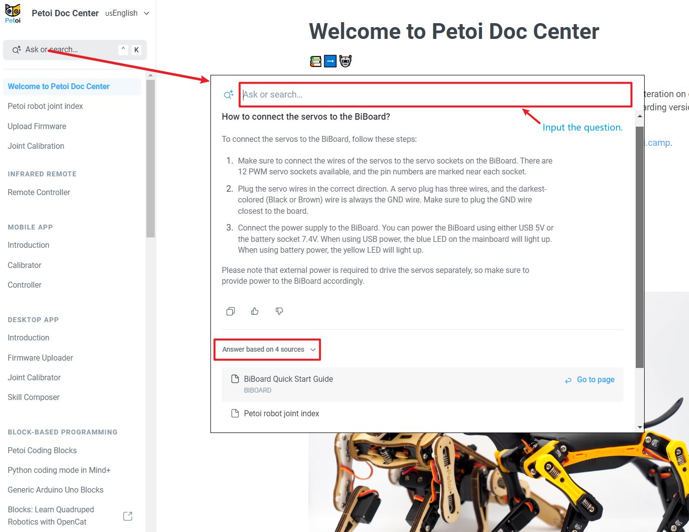
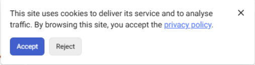

# Welcome to Petoi Doc Center

This is the Petoi product documentation hub. We constantly iterate on our models and codes to bring bionic robotic pets to the world. Please read the notes regarding versions carefully before configuring your robot.&#x20;

If you need help, please write to support@petoi.com or post on our forum at [petoi.camp](https://www.petoi.camp).&#x20;

## Hardware Products

### Check [the Getting Started guide](https://docs.petoi.com/getting-started-guide).

### 😼 [Nybble Cat User Manual](https://nybble.petoi.com)

### 🐶 [Bittle Dog User Manual](https://bittle.petoi.com)

### 🐶 [Bittle X User Manual](https://bittle-x.petoi.com/)

## Intelligent Search

You can use the find (Cmd+K/Ctrl+K) feature on this site. It supports Lens, a ChatGPT-based service.&#x20;

<figure><figcaption></figcaption></figure>

> Note that this privacy notice refuses to disappear!
> 
